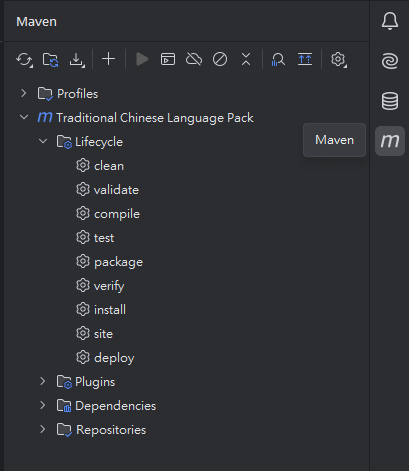
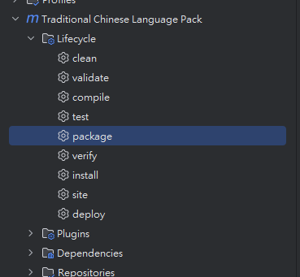

# How to Build a JAR Using Maven

* **Using IntelliJ**
    * Modify the `pom.xml` content:
        * Update the version, tag, etc.
    * Click the Maven logo on the right sidebar.
  
      
  
    * Double-click on `package`.
  
      
  
    * Maven will test and build the JAR file in the `target` folder.
